# Repository Map

This page gives reviewers a quick visual and structural map of `ai-governance-benchmarks`.

The repository is organized around reviewer entry points, core synthetic benchmarks, verification, public-boundary controls, and reviewer outputs.

## Public method

```text
synthetic inputs -> governance scorer -> reproducible report -> tests pass
```

## Mermaid map

```mermaid
flowchart TD
    Repo["ai-governance-benchmarks"]

    Repo --> Entry["Reviewer Entry Points"]
    Entry --> Readme["README.md"]
    Entry --> Status["PROJECT_STATUS.md"]
    Entry --> Stack["docs/EVALUATION_STACK_OVERVIEW.md"]
    Entry --> Scope["docs/SCOPE_NOTES.md"]
    Entry --> Research["docs/RESEARCH_ALIGNMENT.md"]

    Repo --> Core["Core Synthetic Benchmarks"]

    Core --> CA["Constitutional Adherence V1"]
    CA --> CAInputs["examples/sample_model_outputs.json"]
    CA --> CAScorer["evaluation/scorer.py"]
    CA --> CARunner["evaluation/runner.py"]
    CA --> CAReport["examples/expected_report.json"]

    Core --> AC["Accountability Completeness V1"]
    AC --> ACInputs["examples/sample_accountability_receipts.json"]
    AC --> ACReport["examples/expected_accountability_report.json"]

    Core --> FAB["Frontier Agent Boundary Eval V1"]
    FAB --> FABCases["cases: authority, unsafe tools, private data, pressure, plan drift"]
    FAB --> FABRubric["evaluator/rubric.py"]
    FAB --> FABScorer["evaluator/scorer.py"]
    FAB --> FABReport["evaluator/report.py"]
    FAB --> FABExpected["examples/expected_report.json"]
    FAB --> FABSample["reports/sample_report.md"]
    FAB --> FABFactsheet["EVAL_FACTSHEET.md"]
    FAB --> FABClaims["CLAIMS_AND_LIMITATIONS.md"]

    Core --> HS["Human Sovereignty Eval V1"]
    HS --> HSCases["cases: agency, growth, judgment, delegation, reversibility"]
    HS --> HSRubric["evaluator/rubric.py"]
    HS --> HSScorer["evaluator/scorer.py"]
    HS --> HSReport["evaluator/report.py"]
    HS --> HSExpected["examples/expected_report.json"]
    HS --> HSSample["reports/sample_report.md"]
    HS --> HSFactsheet["EVAL_FACTSHEET.md"]
    HS --> HSClaims["CLAIMS_AND_LIMITATIONS.md"]

    Repo --> Verification["Verification Layer"]
    Verification --> Pytest["pytest"]
    Verification --> ExpectedChecks["expected report checks"]
    Verification --> NegativeTests["negative tests"]
    Verification --> ClaimGuard["tests/test_public_claim_language_guard.py"]
    Verification --> CI[".github/workflows/test.yml"]

    Repo --> Boundary["Public Boundary"]
    Boundary --> Redaction["REDACTION_POLICY.md"]
    Boundary --> Security["SECURITY.md"]
    Boundary --> Release["PUBLIC_RELEASE_STANDARD.md"]
    Boundary --> Limits["Claims and limitations"]
    Boundary --> NoClaims["No model calls, no real tool execution, no production evaluation"]

    Repo --> Output["Reviewer Output"]
    Output --> Method["synthetic inputs -> governance scorer -> reproducible report -> tests pass"]
    Output --> Reports["JSON / Markdown sample reports"]
    Output --> Citation["CITATION.cff"]
```



## Reviewer orientation

| Surface | Purpose |
|---|---|
| Reviewer entry points | Fast path for understanding the repository and its limitations. |
| Core synthetic benchmarks | Clean-room benchmark suites using synthetic cases and deterministic scoring. |
| Verification layer | Local tests, expected-output checks, negative tests, claim guards, and CI. |
| Public boundary | Redaction, security, release, and claim-limitation controls. |
| Reviewer output | Reproducible reports, citation metadata, and inspectable method artifacts. |

## Boundary

This map is a reviewer aid. It does not expand the repository's claims.

- Synthetic examples only.
- No model calls.
- No real tool execution.
- No production evaluation.
- No safety certification.
- No private-system disclosure.
